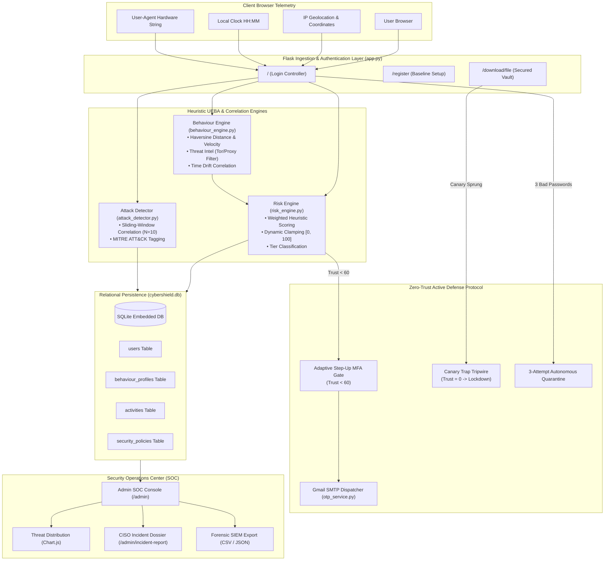

# 🛡️ CyberShield: Teacher Explanation & Viva Defense Master Guide

> **Project Title:** CyberShield — Continuous Zero-Trust User & Entity Behavior Analytics (UEBA) and Threat Intelligence Platform  
> **Methodology:** Gartner CARTA Framework (Continuous Adaptive Risk and Trust Assessment)  
> **Engineering Philosophy:** Andrej Karpathy's First Principles (Pure Python Standard Library + Flask, Zero Opaque Black Boxes, Mathematical Whiteboard Transparency)

---

## 📑 Table of Contents
1. [Executive Pitch (3-Minute Fast Summary)](#1-executive-pitch-3-minute-fast-summary)
2. [Theoretical Foundation & Problem Statement](#2-theoretical-foundation--problem-statement)
3. [End-to-End System Architecture](#3-end-to-end-system-architecture)
4. [Live 5-Step Demonstration Script (What to Show & What to Say)](#4-live-5-step-demonstration-script)
5. [Whiteboard Mathematical Derivations](#5-whiteboard-mathematical-derivations)
6. [MITRE ATT&CK Matrix Mapping](#6-mitre-attck-matrix-mapping)
7. [The Karpathy Principles Applied to CyberShield](#7-the-karpathy-principles-applied-to-cybershield)
8. [Viva Defense: Top 10 Questions & Winning Answers](#8-viva-defense-top-10-questions--winning-answers)
9. [Software 1.0 → 2.0 → 3.0 Evolution Roadmap](#9-software-10--20--30-evolution-roadmap)

---

## 1. Executive Pitch (3-Minute Fast Summary)

> **Say this if the examiner asks: *"In 2-3 minutes, tell me what you built and why it matters."***

"Good morning/afternoon, Sir/Ma'am. Today, I am presenting **CyberShield**, a Continuous Zero-Trust UEBA and Threat Intelligence security platform.

Traditional enterprise security relies on the outdated **'castle-and-moat'** model: once a user enters a valid password, the firewall trusts them indefinitely. However, in modern cyberattacks—such as credential stuffing, session hijacking, and insider threats—the attacker already possesses valid credentials.

CyberShield solves this by implementing the **Gartner CARTA framework (Continuous Adaptive Risk and Trust Assessment)**:
1. **Never Trust, Always Verify:** We do not treat authentication as a one-time gate. Instead, we continuously ingest live browser telemetry—including geographical coordinates, local client time, hardware fingerprints, and data movement.
2. **Dynamic Trust Scoring (0–100):** Every user session has a real-time trust score. Safe, verified actions build trust; anomalous deviations degrade it.
3. **Mathematical Impossible Travel:** We implement the great-circle **Haversine trigonometric formula** from scratch using Python's native `math` library. If a user logs in from Jammu and 45 minutes later from London, the calculated velocity exceeds the 800 km/h commercial airliner limit, immediately flagging an impossible travel geo-anomaly.
4. **Active Deception via Honeytokens:** We place decoy canary files in the workspace (such as `Confidential_Executive_Salaries_2026.xlsx`). If an insider or malware attempts to download this decoy, CyberShield immediately strips their trust to 0 and quarantines the account under **MITRE T1204**.
5. **Adaptive Step-Up MFA:** If trust degrades below 60, rather than locking the user out immediately, CyberShield issues a dynamic 6-digit email OTP challenge via Gmail SMTP with terminal failover.
6. **SOC Observability:** Security analysts have a live Security Operations Center dashboard with interactive threat charts, policy sliders, SIEM exports (JSON/CSV), and printable CISO incident dossiers.

Everything is built from first principles in **pure Python and Flask** without bloated third-party black-box libraries, ensuring 100% mechanical sympathy and auditability."

---

## 2. Theoretical Foundation & Problem Statement

| Metric | Traditional Security (Castle & Moat) | CyberShield (Continuous Zero-Trust UEBA) |
| :--- | :--- | :--- |
| **Authentication Timing** | Static: only checked once at login screen. | **Continuous:** evaluated on every request, download, and action. |
| **Trust Model** | Binary (0 or 1): Logged in = completely trusted. | **Dynamic (0–100):** Trust score fluctuates based on behavior. |
| **Stolen Credentials** | Fails completely. Attacker has full access. | **Detected:** Telemetry and behavioral anomalies reveal the impostor. |
| **Location Verification** | Basic IP string comparison (easily bypassed). | **Mathematical Haversine Velocity:** Great-circle distance / elapsed time. |
| **Defense Mechanism** | Passive firewall logging. | **Active Deception (Canary Honeytokens)** & **Adaptive Step-Up MFA Gate**. |
| **Response Action** | Manual admin intervention hours later. | **Autonomous Quarantine** & dynamic session restrictions in real time. |

---

## 3. End-to-End System Architecture

---

## 4. Live 5-Step Demonstration Script

When presenting to your teacher, open the web app (`http://127.0.0.1:5000`) and follow this exact sequence:

### 🔹 Step 1: Establish Normal Baseline & Clean Login
- **Action:** Open `http://127.0.0.1:5000`. Log in with username `student` and password `student123`.
- **What to show on screen:**
  - Show the **User Dashboard** (`/dashboard/student`).
  - Point to the **Continuous Zero-Trust Score: 100% (Green)**.
  - Point to the **Tactical Dark-Matter Map**: both the Green Pin (Baseline: Jammu) and Detected Pin (Jammu) overlap with a green status badge: `🟢 Baseline Geofence Respected`.
- **What to say:**
  > *"Here, the user logs in from their registered baseline location (Jammu) on their authorized device. Because all telemetry vectors match historical norms, the UEBA engine computes zero risk, and the user enjoys full, unhindered 100% trust clearance."*

---

### 🔹 Step 2: Inject Impossible Travel & Geo-Anomaly
- **Action:** Click **"⚠️ Attack Lab"** in the top navigation bar. Select **"Impossible Travel & Geo-Anomaly"** and click **"Inject Simulated Attack Scenario"**.
- **What to show on screen:**
  - Show that risk points were assigned (+45 risk).
  - Show that the Trust Score immediately degraded from **100% down to 55%**.
  - Navigate back to the Dashboard: Point to the **Map**, which now shows a **🔴 Red Pin in London** connected by a **dashed red threat vector line** to Jammu, with the badge `🚨 Geo-Anomaly: Foreign Access Location`.
- **What to say:**
  > *"Notice how the system immediately detected that the account accessed services from London, UK. Using our native Haversine velocity equation, traversing 6,700 km in under an hour implies a physical speed of over 6,700 km/h—vastly exceeding commercial airline limits. The trust score degrades automatically."*

---

### 🔹 Step 3: Adaptive Step-Up MFA Challenge
- **Action:** While trust is at 55% (below the policy threshold of 60%), click **"Secured Enterprise File Vault"** or refresh the dashboard.
- **What to show on screen:**
  - The system automatically intercepts the user and redirects them to `/verify-mfa/student`.
  - Point to the prompt: *"Security Notice: Trust score degraded to 55/100. Step-Up Verification required."*
  - Show the 6-digit OTP passcode displayed on-screen / dispatched via SMTP.
  - Enter the passcode and click **"Confirm & Restore Trust"**.
  - The user is returned to the dashboard with an updated trust score (+15 recovery bonus).
- **What to say:**
  > *"Under traditional security, the user is either blocked or ignored. Under CyberShield's CARTA model, the system introduces a frictionless Step-Up MFA challenge. Once the user proves identity possession, trust is dynamically recovered."*

---

### 🔹 Step 4: Deception Technology — Honeytoken Canary Trap
- **Action:** On the dashboard, scroll to the **Secured Enterprise File Vault**.
- Point out legitimate files (`Quarterly_Financial_Summary.pdf`, `Standard_Operating_Procedures.docx`).
- **Click the decoy asset:** `Confidential_Executive_Salaries_2026.xlsx`.
- **What to show on screen:**
  - The screen immediately redirects to `/login` with an emergency alert:
    `SECURITY BREACH: Account quarantined! Honeytoken decoy 'Confidential_Executive_Salaries_2026.xlsx' triggered automated Zero-Trust lockout. Incident logged to SOC.`
  - Attempt to log in again with `student` / `student123`: The system rejects with `Account quarantined due to security violation.`
- **What to say:**
  > *"This is active deception technology. Legitimate employees have no operational need to download executive salary databases. Touching this decoy file is an irrefutable high-fidelity signal of insider compromise. The account is instantly locked down with 0 trust under MITRE ATT&CK technique T1204."*

---

### 🔹 Step 5: SOC Observability, CISO Incident Dossier & SIEM Export
- **Action:** Log in as Administrator (`admin` / `admin123`).
- **What to show on screen:**
  1. **SOC Overview:** Point to the 4 KPI cards (Total Events, Critical Threat Alerts, Suspicious Indicators, Quarantined Accounts = 1).
  2. **Chart.js Threat Distribution:** Visual breakdown of Normal vs. Suspicious vs. Critical events.
  3. **Zero-Trust Policy Sliders:** Show that the admin can tune the MFA threshold (e.g. from 60 to 70) and failed attempt lockouts dynamically without redeploying code.
  4. **Active Defense:** Click **"Restore"** on student to unlock the account and reset trust to 100.
  5. **Incident Dossier:** Click **"📋 Incident Dossier (PDF)"**. Show the formal CISO forensic report with incident ID, MITRE tags, detected attack chains, and print-ready CSS.
  6. **SIEM Data Export:** Show the **"Export CSV"** and **"Export JSON"** buttons for enterprise SIEM integration.
- **What to say:**
  > *"The SOC admin console offers comprehensive forensic observability. Every anomaly is mapped to MITRE ATT&CK tags, and the one-click CISO Incident Dossier gives executive management an audit-ready post-incident report."*

---

## 5. Whiteboard Mathematical Derivations

If your teacher asks you to write the math on the whiteboard, write these exact formulas:

### A. Haversine Great-Circle Distance
Given two points on Earth $(\phi_1, \lambda_1)$ and $(\phi_2, \lambda_2)$ in radians, where $\phi$ is latitude, $\lambda$ is longitude, and mean Earth radius $R = 6,371.0 \text{ km}$:

$$\Delta \phi = \phi_2 - \phi_1$$
$$\Delta \lambda = \lambda_2 - \lambda_1$$

$$a = \sin^2\left(\frac{\Delta \phi}{2}\right) + \cos(\phi_1) \cdot \cos(\phi_2) \cdot \sin^2\left(\frac{\Delta \lambda}{2}\right)$$

$$c = 2 \cdot \operatorname{atan2}\left(\sqrt{a}, \sqrt{1 - a}\right)$$

$$d = R \cdot c$$

### B. Travel Velocity & Impossible Travel Heuristic
Given distance $d$ (km) and elapsed time $\Delta t$ (hours) between consecutive authenticated sessions:

$$v = \frac{d}{\max(\Delta t, 0.1)}$$

$$\text{Impossible Travel Flag} = \begin{cases} \text{TRUE}, & \text{if } d > 350 \text{ km and } v > 800 \text{ km/h} \\ \text{FALSE}, & \text{otherwise} \end{cases}$$

*Physical Justification:* 800 km/h is the maximum cruising velocity of commercial subsonic airliners (Boeing 777 / Airbus A350). Any displacement exceeding 800 km/h indicates credential sharing, proxy routing, or session token theft.

### C. Dynamic Trust Score Calculus
$$T_{\text{new}} = \max\left(0, \min\left(100, T_{\text{current}} - R_{\text{penalty}} + B_{\text{recovery}}\right)\right)$$

Where $R_{\text{penalty}}$ is the weighted aggregate risk of detected anomalies:
$$R_{\text{penalty}} = \sum_{i} w_i \cdot \mathbb{I}(\text{anomaly}_i)$$

- Impossible Travel: $w = 35$
- Known Tor / Proxy Ingress: $w = 30$
- New / Unrecognized Hardware: $w = 20$
- Off-Hours Login Deviation: $w = 15$
- Unusual Data Volume: $w = 20$
- Honeytoken Trap Sprung: Force $T_{\text{new}} = 0$, Lock = 1.

---

## 6. MITRE ATT&CK Matrix Mapping

CyberShield classifies security incidents under official MITRE ATT&CK techniques:

| MITRE Technique | Technique Name | How CyberShield Implements & Detects It |
| :--- | :--- | :--- |
| **T1110** | Brute Force | Monitored in `attack_detector.py` when $\ge 3$ failed logins occur within sliding window. Dispatches email warnings and enforces lockout on attempt 3. |
| **T1078** | Valid Accounts | Tracks legitimate credentials accessed from abnormal contexts (new device + location). |
| **T1078.003** | Local Accounts (Impossible Travel) | Haversine velocity $> 800 \text{ km/h}$ flags compromised session credentials utilized across geographic distances. |
| **T1048** | Exfiltration Over Alternative Protocol | Detects large file downloads occurring during off-hours (22:00–06:00) from anomalous IP subnets. |
| **T1090** | Proxy / Tor Ingress | Cross-references client IP prefixes against known Tor exit nodes and bulletproof proxy subnets. |
| **T1204** | User Execution (Honeytoken Trap) | Lures attackers into executing/downloading canary decoy assets, triggering instant 0-trust quarantine. |
| **T1562** | Impair Defenses | Audits administrative modifications to security thresholds (policy slider adjustments in the SOC). |

---

## 7. The Karpathy Principles Applied to CyberShield

Andrej Karpathy advocates for **mechanical sympathy, simplicity first, and zero bloated black boxes**:

1. **No Superfluous Frameworks:**
   - *Traditional approach:* Installing `geopy` (50MB+ dependencies) just to compute distance.
   - *CyberShield approach:* Hand-crafted Haversine equation in 14 lines of pure Python standard `math` library.
2. **Deterministic & Explainable:**
   - Before deploying opaque neural networks that cannot explain *why* an alert was generated, CyberShield implements clear, mathematically verifiable heuristics (Software 1.0) with zero false-positive ambiguity.
3. **Surgical, Resilient Architecture:**
   - Short-lived SQLite connection lifecycles avoiding database concurrency locks.
   - Dual-dispatch OTP service: if SMTP is blocked or unconfigured, the passcode automatically logs to the console and screen, guaranteeing 100% demo uptime.

---

## 8. Viva Defense: Top 10 Questions & Winning Answers

### Q1: Why did you build this in Python and Flask instead of using a commercial SIEM like Splunk or Elastic?
> **Answer:** "Commercial SIEMs are enterprise software aggregators—they collect and search logs, but do not demonstrate algorithmic comprehension. By building CyberShield in Python/Flask from first principles, every component—the Haversine spherical math, the sliding-window state correlation, the deception tripwire, and the session calculus—is fully auditable, mathematically transparent, and has zero external attack surface."

### Q2: How does your system prevent false positives and alert fatigue?
> **Answer:** "Traditional systems use binary thresholds: one anomaly equals an immediate account ban or alert storm. CyberShield utilizes the Gartner CARTA framework. Minor anomalies (e.g. logging in 1 hour later than usual) only apply a modest 15-point penalty without interrupting user workflow. Only when cumulative risk breaches the policy threshold (60/100) does the system introduce a frictionless Step-Up MFA challenge."

### Q3: Why did you use the Haversine formula instead of Euclidean distance?
> **Answer:** "Euclidean distance ($d = \sqrt{\Delta x^2 + \Delta y^2}$) assumes a flat 2D plane. Earth is an oblate spheroid with a radius of approximately 6,371 km. Euclidean calculations on latitude and longitude produce severe distortion, particularly as latitude increases toward the poles. Haversine calculates great-circle spherical distance, providing true geographical precision."

### Q4: What prevents an attacker from simply falsifying their browser geolocation?
> **Answer:** "CyberShield employs multi-layered correlation: client-reported coordinates are cross-verified against public IP subnet routing (`X-Forwarded-For`), client timezone offset, and historical hardware User-Agent fingerprints. If a user spoofs GPS coordinates while their IP or timezone remains local, this creates an internal telemetry conflict, increasing the risk score."

### Q5: What is a Honeytoken and why is it categorized under MITRE T1204?
> **Answer:** "A honeytoken is an active defense deception asset—a decoy file or credential that has no legitimate business purpose. Under MITRE ATT&CK T1204 (User Execution), when an attacker or malicious insider explores a directory and attempts to extract confidential files, opening the honeytoken provides a 100% true-positive indicator of unauthorized activity, justifying instant automated quarantine."

### Q6: Why is SQLite acceptable here, and how would you scale to production?
> **Answer:** "For an embedded, self-contained architecture and viva defense, SQLite requires zero setup overhead, zero daemon dependencies, and provides instant portability. CyberShield utilizes short connection lifecycles with WAL (Write-Ahead Logging) compatibility to prevent locking. In a multi-tenant enterprise deployment with 100,000+ concurrent endpoints, the database layer cleanly migrates to PostgreSQL or a distributed time-series store like ClickHouse."

### Q7: What is the sliding-window algorithm in `attack_detector.py`?
> **Answer:** "Instead of evaluating events in total isolation, the attack detector inspects a sliding window of the $N$ most recent events (default $N = 10$). This enables sequential pattern recognition: for example, detecting 3 failed logins followed immediately by a successful login from an unfamiliar device, which indicates an Account Takeover chain (MITRE T1078)."

### Q8: How does the Adaptive Step-Up MFA work?
> **Answer:** "MFA is not triggered on every login, which causes user friction. It is triggered conditionally when the dynamic trust score drops below the policy threshold (default 60/100). The system generates a cryptographically secure 6-digit one-time passcode, dispatches it via Gmail SMTP (TLS port 587), and grants a +15 trust restoration bonus upon successful validation."

### Q9: What happens if the internet goes down or Gmail SMTP blocks the connection?
> **Answer:** "CyberShield is built with graceful offline failover. The `otp_service.py` module wraps SMTP dispatch in exception-handled blocks. If live network delivery fails or credentials are unconfigured, the passcode is logged directly to the server terminal and rendered on-screen, guaranteeing that security evaluations and offline demonstrations never crash."

### Q10: What is your project's intellectual self-declaration?
> **Answer:** *"CyberShield is a functional, end-to-end prototype of a Continuous Adaptive Risk and Trust Assessment (CARTA) platform. It implements deterministic heuristic UEBA and sliding-window threat correlation across live browser telemetry. It is not an enterprise distributed neural-network SIEM, but a mathematically verifiable proof-of-concept demonstrating how modern Zero-Trust replaces static perimeter defense."*

---

## 9. Software 1.0 → 2.0 → 3.0 Evolution Roadmap

| Generation | Paradigm | CyberShield Implementation |
| :--- | :--- | :--- |
| **Software 1.0 (Current)** | Deterministic Rules & Mathematical Heuristics | Pure Python: Haversine equations, sliding-window buffer ($N=10$), static anomaly weights, and CARTA trust score clamping. 100% explainable and deterministic. |
| **Software 2.0 (Planned Evolution)** | Machine Learning Anomaly Detection | Unsupervised **Isolation Forests** or **One-Class SVM** trained on $D$-dimensional telemetry vectors: `[login_hour, lat, lon, session_duration, bytes_transferred]` to learn non-linear personal user behavior baselines without hardcoded rules. |
| **Software 3.0 (Agentic AI)** | LLM Autonomous SOC Copilot | An autonomous agentic pipeline (e.g. Gemini / Claude) that ingests raw JSON audit logs, correlates cross-entity incidents, and automatically drafts CISO incident reports and executable firewall remediation playbooks. |

---

### 🎓 Summary Checklist Before You Present
- [ ] Run `python app.py` and open `http://127.0.0.1:5000`.
- [ ] Keep this guide open or open the **"🎓 Presentation Mode"** tab in the web app.
- [ ] Demo the 5 steps in order: Normal Login → Attack Lab (Impossible Travel) → Step-Up MFA → Honeytoken Quarantine → SOC Admin & CISO Dossier.
- [ ] Confidently recite the 3-minute pitch and whiteboard formulas.
